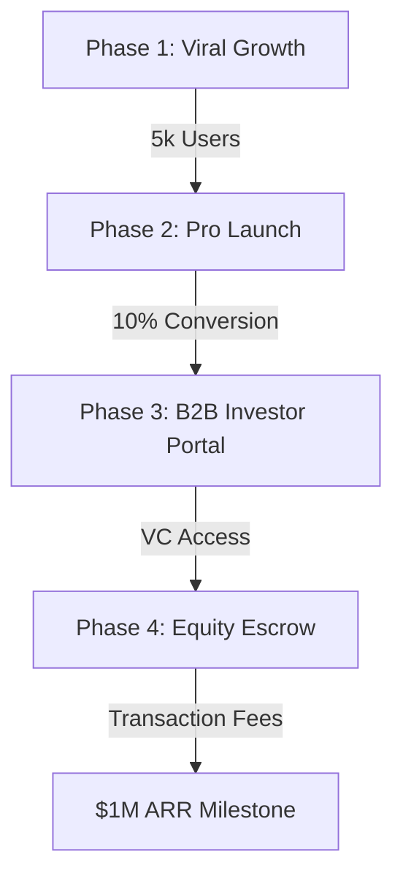

# 🛰️ LINKUP: The Founder's Nexus
> **The ultimate platform for builders, by builders.**

---

## 💎 1. VISION & MISSION
LINKUP is a high-signal social networking platform designed specifically for **founders and technical builders.** We are disrupting the "Corporate Noise" of LinkedIn to provide a pure environment for **Synergy, Execution, and Growth.**

> [!IMPORTANT]
> **Mission**: To accelerate human innovation by matching the right builders with the right ideas, instantly.

---

## 🛠️ 2. CORE ARCHITECTURE

| Module | Feature | Impact |
| :--- | :--- | :--- |
| **DISCOVERY** | Swipe-to-Match | Removes the friction of finding co-founders. |
| **THE FORGE** | Build-Log Feed | Proof-of-work based social interaction. |
| **SYNERGY** | AI Analysis | Matches founders based on complementary skill data. |
| **REPUTATION** | "REP" Score | Gamified status based on shipping frequency. |

---

## 💰 3. MONETIZATION STRATEGY

### 🟢 FREE TIER (Community Growth)
*Maintain a high-quality talent pool and viral growth.*
- ✅ **Unlimited Swipes**: Basic profile discovery.
- ✅ **Social Feed**: Post builds and interact.
- ✅ **Basic Messaging**: Chat with mutual matches.
- ✅ **AI Synergy**: Basic match reasoning.

### 👑 PRO TIER (High-Velocity Founder)
*Speed, Privacy, and Elite Networking.*

> [!TIP]
> **Target Revenue**: $14.99/mo | Estimated Conversion: 5-8% of active users.

#### **Premium Feature Set:**
- 🕵️ **Stealth Mode**: Browse the network anonymously. Essential for stealth-mode founders.
- ⚡ **AI Warm Intros**: The AI drafts high-conversion opening messages for you.
- 👁️ **Who Viewed You**: Deep analytics on who is researching your profile.
- 🔥 **AI Post Roasts**: Brutal, constructive AI feedback to improve your MVP.
- 🏆 **Verified Exit Badge**: Exclusive status symbol for serial entrepreneurs.
- ⏪ **Unlimited Rewinds**: Never miss a potential match by mistake.
- 🚀 **Priority Discovery**: Your profile appears first in other users' stacks.

---

## ⚔️ 4. THE LINKEDIN KILLER
*Why LINKUP wins where LinkedIn fails:*

1.  **Zero Noise**: No recruiters, no HR spam, no "hustle culture" fluff. Only **Builders.**
2.  **Verified Competence**: LinkedIn endorsements are meaningless. LINKUP "Rep" and "Build Logs" are **Proof of Work.**
3.  **AI as a Partner**: We use AI for **product-market fit and co-founder synergy**, not just writing generic posts.
4.  **Premium Aesthetic**: Dark mode, "Liquid Glass" UI, and a high-speed interface that feels like a dev tool.

---

## 🗺️ 5. ROADMAP TO $1M ARR

1.  **Phase 1 (Community)**: Launch via X (Twitter), IndieHackers, and ProductHunt.
2.  **Phase 2 (Pro Tier)**: Gating analytics and AI tools to drive immediate revenue.
3.  **Phase 3 (B2B)**: Investors pay $499/mo to scout high-REP "Rising Star" builders.
4.  **Phase 4 (Equity Escrow)**: Take a 2% fee on skills-for-equity contracts signed in-app.

---

> [!CAUTION]
> **LINKUP: STOP TALKING. START BUILDING.**
