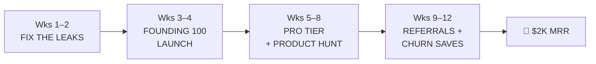

# 🎯 ROAD TO $2K MRR — The 50-User Plan
> **Goal: $2,000/month recurring. ~50 paying users. $40 ARPU.**
> We are not chasing viral. We are hunting 50 founders who pay.

---

## 🧮 1. THE MATH

Charging $19.99/mo to everyone requires **100+ subscribers**. You said 50 users is fine — so we change the pricing, not the target. $2,000 ÷ 50 = **$40/month average per user.** That means a two-tier play:

| Tier | Price | Paying Users | MRR |
| :--- | ---: | ---: | ---: |
| 👑 **PLUS** (exists) | $19.99/mo | 25 | $500 |
| 💎 **PRO** (new) | $49/mo | 25 | $1,225 |
| 🏆 **Founding Annual** | $299/yr (≈$25/mo) | 12 | $300 |
| **TOTAL** | | **~60** | **$2,025/mo gross** |

**Fee reality check:** Google Play takes 15% → ~$1,721 net. Stripe on web takes ~3% → **sell on web whenever possible, it's +12% margin on the same customer.** To net a true $2k after all fees, push PLUS to ~35 subs (≈72 total payers).

**Fast cash variant (do both):** a "Founding 100" annual push. Every annual sold = $299 cash *today*. 20 annuals in launch month = **$5,980 in the bank** while MRR builds.

---

## 🚨 2. THREE REVENUE LEAKS FOUND IN THE CODE (fix first)

These are real, verified in this repo. Each one is money walking out the door:

### Leak #1 — Web is a free buffet
`mobile/src/lib/paywall.ts`: `hasLinkupPro()` returns `true` for **everyone on web** (expo-iap has no web store). Everyone arriving from a LinkedIn/X share link lands on web and gets PRO free, forever.

**Fix:** Stripe checkout on web. This is the #1 build item. Stripe also unlocks payment links you can DM to people — no Play Console friction, close sales manually.

### Leak #2 — The free tier has nothing to sell against
`FREE_LIMITS` in `paywall.ts`: swipes `9999`, saved profiles `9999`, ideas `9999`. The only real gates are 2 daily recommendations and 3 analyzer runs. **Nobody needs to upgrade.**

**Fix:** make free a *demo*, not a *product*:
- Discovery: **12 profiles / 12 hrs** (paywall copy already promises this — enforce it)
- Who Viewed You: **PLUS only** (this is the single highest-converting gate in social apps)
- AI Warm Intros: **1 free/month**, unlimited on PLUS
- Saved profiles: **5 max** free

### Leak #3 — No server-side subscription verification
Entitlement is written **client-side** by `PaywallModal.tsx` straight to Firestore. Nothing checks with Google Play whether the sub is still active → cancelled/expired users keep PRO forever, and anything can write `isPro: true`.

**Fix:** Cloud Function + Play Developer API (`purchases.subscriptionsv2.get`) + Real-time Developer Notifications (Pub/Sub) to grant/revoke server-side. This also enables win-back messages the moment someone churns.

---

## 💎 3. PACKAGING — WHAT PRO ($49) SELLS

PLUS ($19.99) stays as-is. **PRO ($49/mo)** = PLUS + status + speed for the high-velocity founder:

- 🥇 **Priority Discovery** — your profile is dealt first in everyone's stack
- 🏷️ **Deal Flow listing** — PRO startups appear in a dedicated "raising/visible" rail that later becomes the investor portal (Phase 3 of the business plan — seed it now)
- 🤖 **Unlimited Linky + Startup Analyzer** (free: 3/day, PLUS: 20/day)
- ✍️ **Monthly AI pitch roast** — brutal deck/MVP teardown (marketing gold, cheap to serve, we already have Gemini functions)
- 🟦 **PRO badge + crown** — visible status, sells itself in screenshots

New Play product IDs: `linkup_pro_monthly` ($49), `linkup_pro_yearly` ($349). Mirror in Stripe for web.

**Do NOT** gate basic matching or messaging — charging for core network access when the network is small kills liquidity. Sell **speed, visibility, status, and intelligence.** That's what founders paying $49 are buying.

---

## 📣 4. GO-TO-MARKET — WHERE 50 PAYERS COME FROM

At 50 users this is a **direct-sales problem, not a marketing problem.**

### Channel 1: Your own DMs (the main one, weeks 1–12)
- 10 personal DMs/day to builders in `#buildinpublic` on X, IndieHackers, r/cofounder, Discord/Telegram founder groups, hackathon participant lists
- Script: *"Saw you're building X. I built an AI matcher for founders — want free PRO for a month? Only catch: tell me what sucks."* → convert at end of month
- 300 DMs/month → ~60 trials → **~15 payers/month** at 25% trial→paid

### Channel 2: "Founding 100" launch (weeks 3–4)
- $299/yr, founding badge, **price locked for life**, numbered member (#001–#100)
- Posted everywhere with the 50 ready-made posts in `linkedin-posts.md` — rewritten to say "and here's why I'm charging from day 1"
- Stripe payment links in every post → friction-free

### Channel 3: Product Hunt + communities (weeks 5–8)
- Launch with a PH-only deal: first year $199 via web checkout
- Matchathon-style event (there's already `events/MATCHATHON_72_BRIEF.md` — run it as a paid-gated exclusive for members)

### Channel 4: Manual investor pilots (weeks 8+)
- DM 30 angels/scouts: *"$149/mo to see our top REP builders before anyone else."*
- Close **3** = +$447 MRR. This de-risks the whole plan and pre-builds Phase 3.

### Referral loop (once 20+ payers)
- 1 free month of PRO per paid referral. At this scale it's the cheapest acquisition there is.

---

## 🗓️ 5. THE 90-DAY EXECUTION CALENDAR

| Weeks | Ship | Target |
| :--- | :--- | :--- |
| **1–2** | Stripe web checkout + founding offer page · enforce real free limits · Play products live · paywall analytics events | Paywall actually has something to sell on every platform |
| **3–4** | Founding 100 launch · 10 DMs/day · 3 posts/week | 20 annuals sold (**~$6k cash**), 10 monthly subs |
| **5–8** | PRO tier live (Play + Stripe) · Product Hunt · server-side entitlement verification (RTDN) · first 3 investor pilots | +25 payers → **~$1.4K MRR** |
| **9–12** | Referral loop · dunning/win-back automation · double down on best-converting channel | **60–75 payers → $2K+ MRR** |

**Weekly scoreboard (non-negotiable, 10 min every Monday):**
- Paywall views → checkout starts → paid (want: 20% start, 50% close)
- New payers / churned payers this week
- MRR, ARPU (target $40), annual cash collected
- DMs sent (the number you actually control)

---

## ⚠️ 6. RISKS & HOW WE PLAY THEM

| Risk | Mitigation |
| :--- | :--- |
| Gating too hard kills the small network | Free tier stays genuinely useful for matching; only speed/visibility/AI/status are paid |
| Churn on $49 tier | Annual-first offers (2 months free), monthly AI pitch roast as a recurring "must-not-miss" ritual, exit survey + win-back |
| Expired subs still showing PRO | Server-side verification (Leak #3) — priority build |
| You DMing forever doesn't scale | It doesn't need to. It needs to get to 60. Referrals + PH take over after |
| App-store review friction on new tiers | Ship web/Stripe first — same revenue, instant iteration, no review queue |

---

> [!IMPORTANT]
> **The whole strategy in one line:** stop leaking revenue (web free, fake limits, no verification), sell a $49 tier ≈25 founders actually want, and close 60 paying humans by hand.
>
> **STOP TALKING. START SELLING.** 🧱
